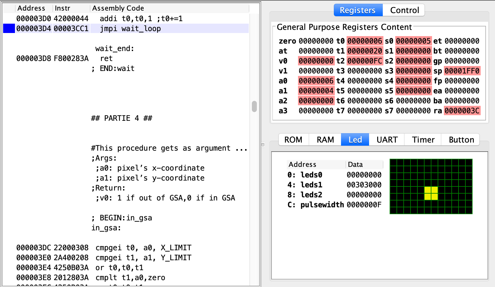

# Tetris
This project consists of a fully implemented assembly [Tetris](https://en.wikipedia.org/wiki/Tetris) game meant to be played on a Nios II FPGA architecture.

# Nios II Simulator

The _NiosII.jar_ file contains a simulator that can be used to simulate the game without the need of a FPGA. You only need to launch the _.jar_, open the _tetris.asm_ file and click on start simulation.  
This simulation allows you to visualise the LED movement, the current state of the ROM/RAM/registers and to interact with the game via buttons.

  

## Contributors
[Squalene](https://github.com/Squalene), [loh0um](https://github.com/loh0um)
